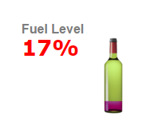
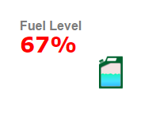

# Kibana Metric (improved, I think) Visualization Plugin

This is a Metric visualization (visType for Kibana, version 4.4.1) that actually goes a little 
beyond the metric visualization currentyl shipped with Kibana.

If you really liked this and feel like making a donation : <a href="https://www.paypal.com/cgi-bin/webscr?cmd=_donations&business=juan.carniglia@gmail.com&lc=AR&item_name=JuanCarniglia&item_number=1005&currency_code=USD&bn=PP-DonationsBF:btn_donate_LG.gif:NonHosted">

</a>



One value, showing a smiling face if the value is over $5000 and a sad face if it is not.



One value, showing a number in Bytes and an image according to disk storage.

##Installation Steps

(Theses are optional, you can just copy the kbn_picture_values_vis folder into
KIBANA_HOME/src/plugins) and run kibana.

```
git clone https://github.com/JuanCarniglia/kbn_picture_values_vis.git 
cd kbn_picture_values_vis
npm install
npm run build
cp -R build/kbn_picture_values_vis/ KIBANA_HOME/installedPlugins
```

** Note: this plugins requires numeral.js
** If you don't have it, you can just `npm install -g numeral` or install the plugin.

##How does it work

In order to work this plugins needs a simple Schema configuration:

- One Metric Parameter
- A Json to set some things up:

```
[ 
   { "text" : "CUENTA", "letter" : "\uf119", "numeralFormat": "$0,0.0", "ranges" : 
      [ 
         { "min" : 0,    "max": 2000,  "valueColor" : "red",   "letter" : "\uf119"},
         { "min" : 2000, "max": 10000, "valueColor" : "green", "letter" : "\uf118"} 
      ] 
   },
   { "text" : "PROMEDIO", "letter" : "\uf119", "numeralFormat": "$0,0.000", "ranges" : 
      [ 
         { "min" : 0,   "max": 0.8, "valueColor" : "red",   "letter" : "\uf119"},
         { "min" : 0.8, "max": 10,  "valueColor" : "green", "letter" : "\uf118"} 
      ] 
   }
]
```

In this example, the JSON string sets up two different labels/values/icons.

For each one, it defines:
  - A label (string) or title.
  - A letter (character actually)
  - An optional numeric Format (for instance, to display currency or something else).
  - Optional Ranges 

These are used to display different font-awesome icons, depending on where the value falls.
The ranges should be suplementary and not step on each other (i.e. 0-100 100-500 500-1000). 
For each range an icon, and a text color are defined (which superseed the character defined at the main level, unless the value falls out of range). 
  
!! The order in which the main items (the items in the main collection) is defined is important, as it should match the order of the aggregations.

You can also choose whether to show pictures (icons) at all.

Check out numeral format options at NumeralJS documentation. <http://numeraljs.com/>.

Check out all available fontAwesome icons at the fontAwesome Cheat Sheet. <http://fortawesome.github.io/Font-Awesome/cheatsheet/>.

Remember to surround each field name with double quotes and to change the fontAwesome codes from `"&#xf12d;"` into just `"\uf12d"`.
